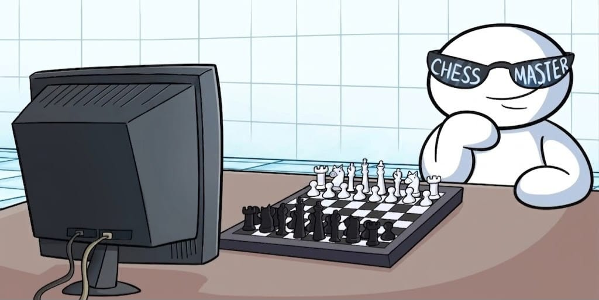

<div align="center">

# ♟ CHESSKIDSDOTCOM

### A chess engine I started building because I thought  
### “how hard could it really be?”

<br>


</div>

---

<div align="center">

<table>
<tr>

<td align="center">



### I am the Chess Master.

Started with minimax.  
Felt smart for about 14 minutes.

</td>

<td align="center">


### Take THAT !!

Then came:
- move generation
- legal positions
- en passant
- transposition tables
- and suffering.

</td>

<td align="center">


### “Amateurs.”

Current objective:

Make the engine stronger than me  
before I lose my sanity debugging it.

</td>

</tr>
</table>

</div>

---

# What even is this?

`chesskidsdotcom` is a chess engine written in C++17.

The name comes from the website I used to play chess on growing up, so I kept it instead of giving it some ultra-serious engine name.

The project started as:
> “it would be cool to make a chess AI.”

Then I discovered chess engines are basically:
- optimization
- math
- debugging
- recursion
- performance engineering
- and trying to make millions of positions behave correctly.

---

# Features

Currently implemented:

- Bitboard board representation
- Hybrid mailbox + bitboards
- Packed 32-bit move encoding
- Incremental make/unmake
- Zobrist hashing
- Alpha-beta search framework
- Transposition tables
- UCI support
- Perft framework
- Debug validation tools
- Modular engine structure

In simpler words:

The engine can:
- understand chess positions
- generate moves
- search future positions
- evaluate positions
- and slowly destroy my sleep schedule.

---

# Why I made this

Mostly because:
- chess is cool
- low-level programming is cool
- and I wanted to understand how real chess engines actually work internally.

Also because watching Stockfish instantly destroy people made me curious how something like that is even built.

Turns out:
very painfully.

---

# Build

```bash
make
./chesskidsdotcom
```

Debug build:

```bash
make debug
```

---

# UCI

The engine supports the UCI protocol, so it can connect to chess GUIs like:

- CuteChess
- Arena
- BanksiaGUI
- ChessBase

Basic commands:

```text
uci
isready
position startpos
go depth 6
quit
```

---

# Current State

Right now the engine is still being actively developed.

Current focus:
- move generation
- legal move filtering
- search improvements
- evaluation tuning
- and fixing bugs that should not exist but somehow do.

---

# Final Thoughts

This project taught me that chess engines are less about “AI magic” and more about:
- efficiency
- correctness
- search optimization
- and making sure one illegal move doesn’t destroy the entire engine.

Still one of the most fun projects I’ve worked on.

---

<div align="center">

### ♞ Play. Learn. Give up. Repeat.

### Built by C. Kumaran

</div>
